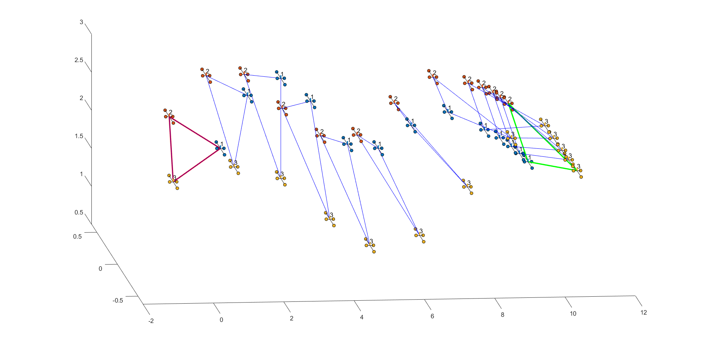

# Quick Description

###### The configuration of the formation control is described in [Alexandre S Brandao et al. “A multi-layer control scheme for a centralized uav formation”. In: 2014 International Conference on Unmanned Aircraft Systems (ICUAS). IEEE. 2014, pp. 1181–1187.]

###### The formation configuration has two levels: 
	    1- Control the formation shape (stabilizing the relative distances between agents).
        2- Trajectory tracking control for each robot (following the predefined path).
        
	
	
	
###### In the simulation below we considered a Hover like system  --->  Applying a Proportional and derivative controller [Wudao Ling Xuanyu Zhou Yiren Lu Myles Cai. Dynamic Dynamic Modeling, Control and Simulation of an Autonomous Quadrotor.. 2017. url: https://github.com/yrlu/quadrotor (visited on 2017)].

	NOTE: 
	  1- run Initial_conditions.m

      2- run the simulink file
      
      3- run sim_drone_triangle.m
      
      
		
		

		
